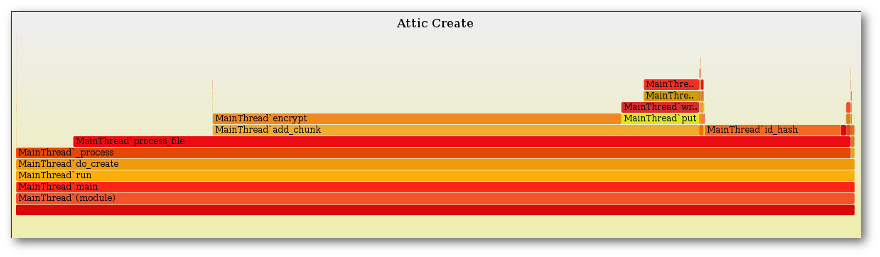
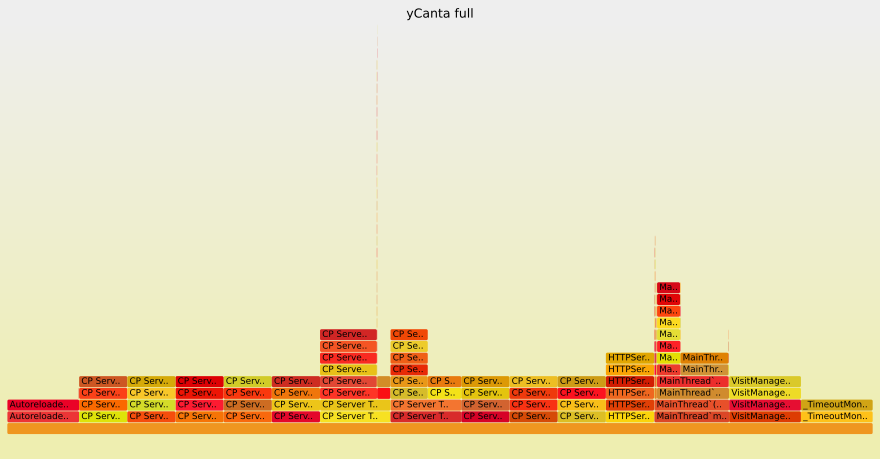
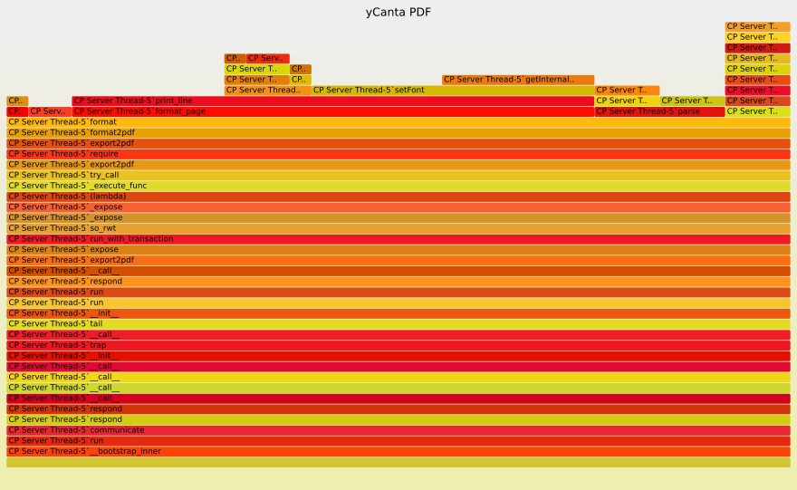

A simple statistical profiler which outputs in format suitable for FlameGraph_.

INSTALL:
--------

Simply run::

  pip install git+https://github.com/evanhempel/python-flamegraph.git

USAGE:
------

Run your script under the profiler::

  python -m flamegraph -o perf.log myscript.py --your-script args here

Run Brendan Gregg's FlameGraph_ tool against the output::

  flamegraph.pl --title "MyScript CPU" perf.log > perf.svg

Enjoy the output:

**Filtering**

Sometimes you may want to exclude a method
(for example in a server the method that waits for a new request)
or you may want to profile only a subset of your code
(a particular method and its children which are performance critical).

Filtering can be done by passing a python regular expression to the
``-f`` or ``--filter`` command line option
which will restrict output to only those lines which match.
Filtering is done against the entire line so you can filter by
function name, thread name, both, or even by
more complex filters such as function ABC calls DEF (``ABC.*DEF``).

Alternatively since the output is stackframes each on a line by itself,
this can simply be done with a simple grep filter.::

    Exclude:

      grep -v waiting_method perf.log > removed_waiting.log

    Include:

      grep function_name perf.log > filtered.log

Then run the flamegraph.pl script against the filtered file.

  Full profile output of yCanta_ webapp PDF export.  Most time is
  spent in wait state and graph is not very helpful.

  Filtered profile output of yCanta_ webapp PDF export.  Filtering was on the
  pdf format function so time spent in wait state has been excluded and the
  graph is now helpful.

.. _FlameGraph: http://www.brendangregg.com/flamegraphs.html

.. _yCanta: https://github.com/yCanta/yCanta
